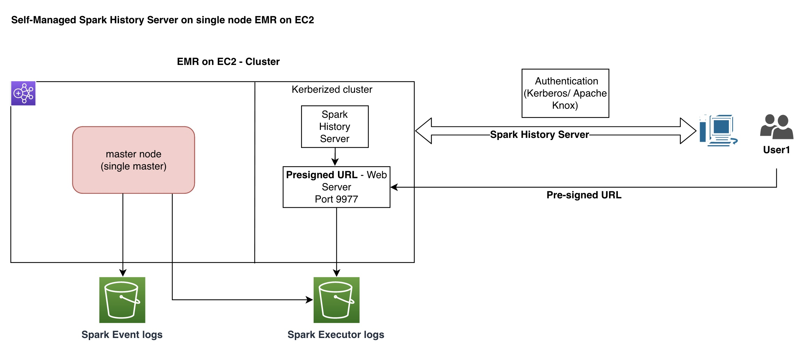
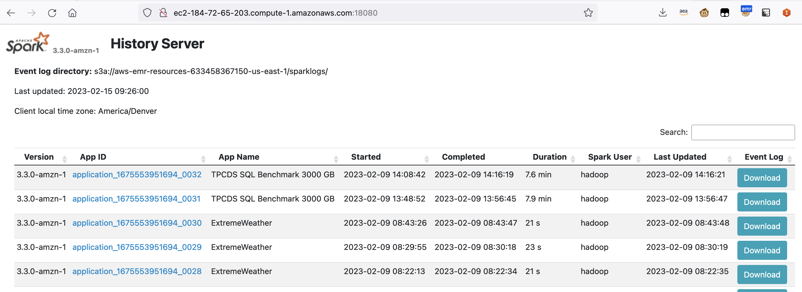

# Create Self Managed Spark History Server on EMR on EC2

It is possible to debug and monitor your Apache Spark jobs by logging directly into the [off-cluster, persistent, Spark History Server](https://docs.aws.amazon.com/emr/latest/ManagementGuide/app-history-spark-UI.html) using the EMR Console (Amazon EMR Version 5.25 onward). You can quickly analyze and troubleshoot active jobs and job history without setting up a web proxy through an SSH connection, on-cluster UI was also introduced with new EMR Console. You can access application history and relevant log files for active and terminated clusters. 

## Limitations

1. The logs are available for active clusters and are retained for 30 days after the cluster is terminated. Some customers require longer retention period for the application logs.
2. The managed SHS has a static base logging directory pointed to the EMR managed S3 bucket. It does not work with self-managed S3 buckets.
3. The managed SHS can become slow with too many applications logs in the same S3 directory. It can take few minutes to launch the application with thousands application logs. A S3 partition structure is needed for large long-running EMR clusters.
4. The customer need to access the EMR managed Spark History Server via **the EMR console**. This is not desired for customers who have strict AWS console access controls.

Even though we recommend customers to utilize managed SHS option wherever possible, not desirable due to above limitations for all the customers. **In this self-managed SHS solution**, we will setup SHS on EMR on EC2 single master (but customers can also expand this to work on [EC2 or containerized solution](https://docs.aws.amazon.com/glue/latest/dg/monitor-spark-ui-history.html)).

## Solution Overview



**Step 1:** Provisioning EMR cluster to write spark logs to external S3 bucket with Steps:

EMR Configuration to write data to customer owned Amazon S3: 

To overcome all these limitations, and having a more flexible way to access Spark history, you can configure Spark to send the logs to a S3 bucket. 
Here is a simple [configuration](https://docs.aws.amazon.com/emr/latest/ReleaseGuide/emr-configure-apps.html) that you can adapt for your EMR cluster:

```
[{
"classification":"spark-defaults",
"properties":{
"spark.eventLog.dir":"s3a://<yourbucketname>/sparkhistory",
"spark.history.fs.logDirectory":"s3a://<yourbucketname>/sparkhistory",
"spark.history.custom.executor.log.url":"http://<your_host>:9977/<yourclusterID>/containers/{{APP_ID}}/{{CONTAINER_ID}}/{{FILE_NAME}}.gz"
spark.hadoop.fs.s3a.endpoint s3.amazonaws.com
spark.hadoop.fs.s3a.customAWSCredentialsProvider com.amazonaws.auth.DefaultAWSCredentialsProviderChain
}
}] 
```

Spark History server will require emrfs-hadoop-assembly JAR file and aws Java SDK jars to be able to access S3 buckets. So you need to create a symbolic links and restart the Spark History Server.

Here is the simple shell script for this task 

The first few lines finds the correct JAR files and then create a symbolic link, then creates a path in S3 bucket and restarts Spark History Server. You need to edit/upload this shell script to your S3 bucket, and define a CUSTOM_JAR step to launch this script:


```
[{
 "Args":[
 "s3://yourbucketname/sparkhistory.sh"
 ],
 "Type":"CUSTOM_JAR",
 "ActionOnFailure":"CONTINUE",
 "Jar":"s3://us-east-1.elasticmapreduce/libs/script-runner/script-runner.jar",
 "Properties":"",
 "Name":"Setup Spark History"
}]
```

If you add the above configuration and the step, to your transient cluster, the logs will remain in the S3 bucket and you will be able to view the old jobs when you create a new EMR cluster (with same configuration).

**Step 2:** Set up a proxy server on master node to serve pre-signed S3 URL for executor logs:

Here is the simple python code for this task 
Run proxy server on master node (this step can also be part of cluster bootstrap/step. This proxy server will listen on port 9977 and serve as a presigned URL for S3 bucket/key requested from Spark history server executor logs.

```
nohup python3 py_web_server.sh &
```

**Step 3:**  Set up a web proxy through an SSH connection:

Configure proxy settings to view websites hosted on the primary node:
https://docs.aws.amazon.com/emr/latest/ManagementGuide/emr-ssh-tunnel.html




